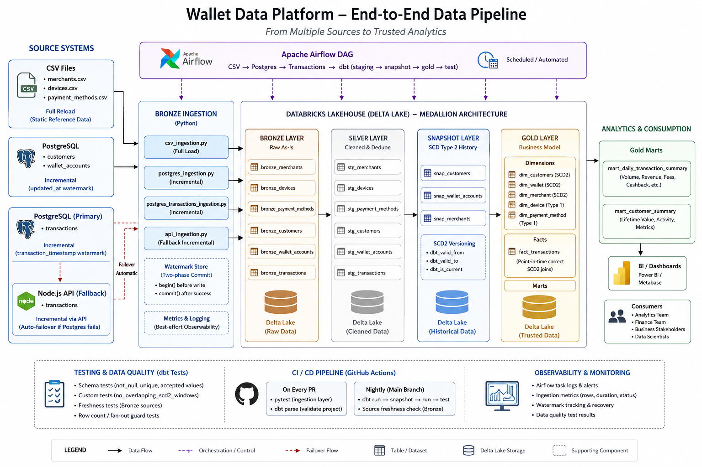

# Wallet Data Platform

An end-to-end data engineering pipeline for a digital wallet / payments
business — three source systems, a medallion lakehouse, and a full
Bronze → Silver → Snapshot → Gold build orchestrated by Airflow.



---

## What this pipeline does


| Source | Tables | Load strategy |
|---|---|---|
| CSV (local files) | `merchants`, `devices`, `payment_methods` | Full reload — small, static reference data |
| PostgreSQL | `customers`, `wallet_accounts` | Incremental, watermarked on `updated_at` |
| PostgreSQL (primary) → Node.js API (fallback) | `transactions` | Incremental, watermarked on `transaction_timestamp`; API pipeline takes over automatically if Postgres fails |

Everything lands in Bronze as-is, gets cleaned and deduplicated in Silver,
versioned into full SCD Type 2 history in the snapshot layer, and
assembled into a star schema in Gold — a customer/wallet/merchant
dimension set (plus Type 1 device/payment method dims) and a
point-in-time-correct `fact_transactions` table.

## Engineering highlights

These are the parts of the pipeline that took real design work, not
boilerplate:

**Two-phase watermark commits.** Every incremental pipeline calls
`watermark_store.begin()` *before* writing to Bronze and `.commit()`
*after* the write succeeds. If a run crashes mid-write, the next run
finds a pending-but-uncommitted watermark, rolls back the orphaned batch
by `batch_id`, and retries cleanly — instead of either silently losing
data or double-counting it.

**Point-in-time SCD2 joins in `fact_transactions`.** Dimension keys
aren't resolved against "whatever the dimension looks like today" —
each transaction is range-joined against `[dbt_valid_from, dbt_valid_to)`
on the SCD2 snapshot so it always resolves to the customer/wallet/merchant
version that was actually current *at the moment the transaction
happened*. A custom generic test (`no_overlapping_scd2_windows`) guards
the invariant this join depends on.

**3-day lookback on incremental fact loads.** `fact_transactions` is
incremental + merge, not a full rebuild — but a naive
`> max(transaction_timestamp)` filter would permanently miss any
transaction that lands late with an earlier timestamp than one already
loaded (clock skew, out-of-order API pages). A bounded 3-day lookback
re-scans a small, cheap slice of recent data every run and lets `merge`
on `transaction_id` de-duplicate anything reprocessed.

**Primary/fallback source failover.** Transactions load from PostgreSQL
first; if that fails, the pipeline automatically falls back to the
transactions API without manual intervention, and the Airflow DAG models
this explicitly with `TriggerRule.ALL_FAILED` / `ONE_SUCCESS` rather than
hiding it inside one function.

**Documented gaps, not hidden ones.** Accepted-value tests that are
still running on limited sample data (`risk_level`, `wallet_status`) are
marked `severity: warn` until verified against real data, and tightened
to `error` once they are — rather than either silently passing bad data
or blocking builds on unconfirmed assumptions.

## Project structure

```
├── ingestion/                  # Python Bronze ingestion (CSV, Postgres, API)
│   ├── config.py                # env-driven settings, no hardcoded secrets
│   ├── csv_ingestion.py
│   ├── postgres_ingestion.py
│   ├── postgres_transactions_ingestion.py
│   ├── api_ingestion.py         # fallback source for transactions
│   ├── databricks_writer.py     # Delta/Bronze writer via Databricks Connect
│   ├── metrics_writer.py        # best-effort observability logging
│   └── utils.py                 # two-phase WatermarkStore, validation
│
├── dbt/wallet_dbt/
│   ├── models/
│   │   ├── staging/              # Silver — clean, cast, dedupe
│   │   ├── gold/dimensions/       # SCD2 dims (customer, wallet, merchant) + Type 1 (device, payment method)
│   │   ├── gold/facts/            # fact_transactions — incremental, point-in-time dimension joins
│   │   └── gold/marts/            # daily transaction summary, customer summary
│   ├── snapshots/                 # SCD2 snapshot definitions (timestamp + check strategies)
│   ├── macros/generic_tests/       # custom data quality tests
│   └── tests/singular/             # fan-out / row-count guard tests
│
├── airflow/
│   ├── dags/wallet_bronze_ingestion.py   # CSV → Postgres → Transactions → dbt (staging/snapshot/gold/test)
│   └── dbt_profile/                       # profiles.yml (env-var driven, no committed secrets)
│
├── datasets/                    # sample CSV reference data
├── tests/                       # pytest suite for the ingestion layer
└── .github/workflows/
    ├── ci.yml                    # pytest + dbt parse on every PR
    └── dbt-nightly.yml            # full dbt build/test against a live warehouse
```

## Data model

**Gold layer** — one row per transaction in `fact_transactions`, joined
to:

- `dim_customers`, `dim_wallet`, `dim_merchant` — full SCD Type 2 history,
  resolved point-in-time
- `dim_device`, `dim_payment_method` — Type 1 (no history needed; small,
  closed reference sets)

Two marts sit on top: `mart_daily_transaction_summary` (volume/revenue by
day, merchant category, city, currency) and `mart_customer_summary`
(lifetime spend and transaction metrics per current customer).

## Running it

```bash
python -m venv .venv && source .venv/bin/activate
pip install -r requirements.txt
cp .env.example .env      # fill in Postgres / Databricks / API credentials
python ingestion/main.py  # runs CSV → Postgres → Transactions, in order
```

dbt (from `dbt/wallet_dbt/`):

```bash
dbt run --select tag:silver
dbt snapshot
dbt run --select tag:gold
dbt test
```

Or run the whole thing end-to-end via Airflow:

```bash
docker compose up airflow-init   # once
docker compose up -d             # webserver + scheduler → localhost:8080
```

## Testing & CI

- **`pytest`** covers the ingestion layer — watermark two-phase commit
  semantics, pagination/retry logic for the API source, streaming
  extraction from Postgres, and pipeline fallback ordering.
- **`dbt parse`** runs on every PR against dummy Databricks credentials —
  validates every `ref()`, Jinja block, and YAML file with no live
  warehouse connection required.
- **A nightly workflow** runs the full `dbt run` → `snapshot` → `run` →
  `test` cycle against a live warehouse and checks Bronze source
  freshness, independent of whether anything was pushed that day.

## Known limitations


- The local `WatermarkStore` is a JSON file — fine for a single-node
  portfolio run, but the interface is intentionally small so it can be
  swapped for a Delta table or Airflow `Variable` without touching the
  ingestion classes.
